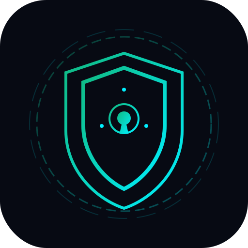
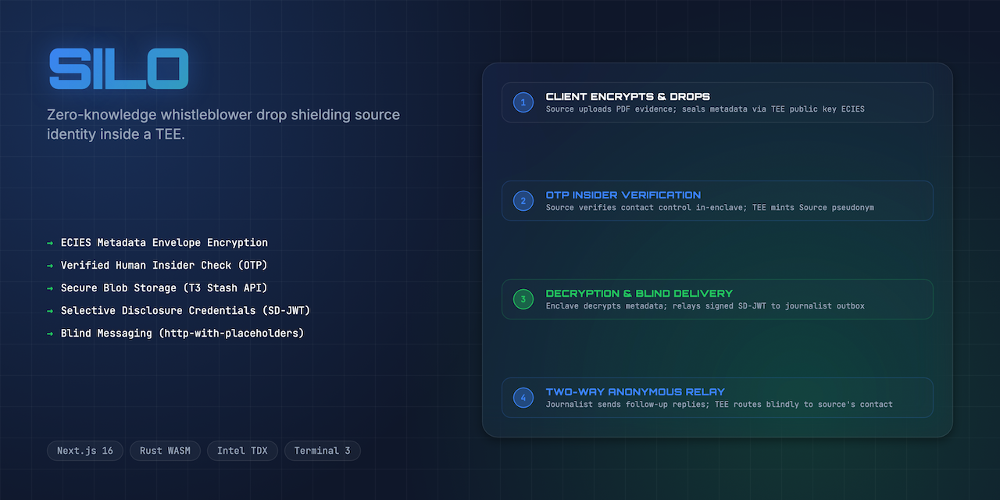
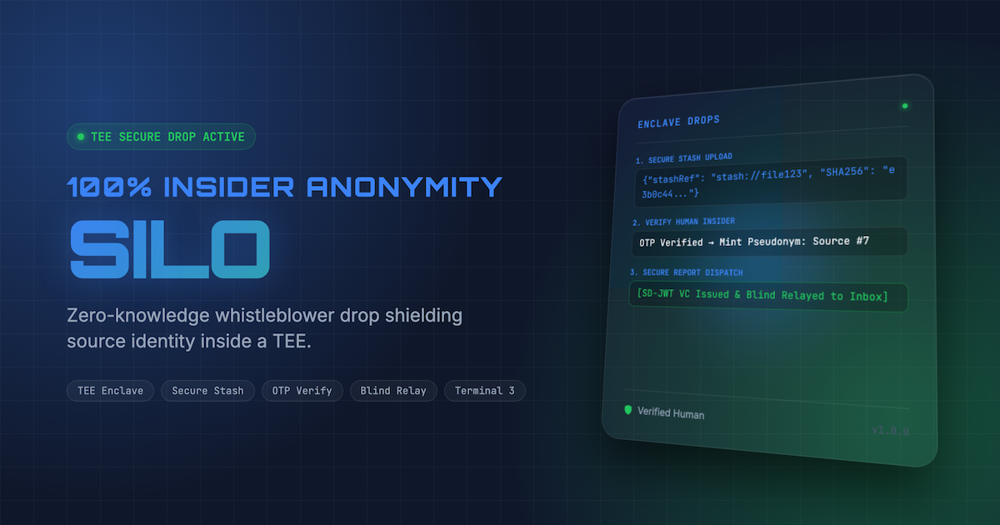
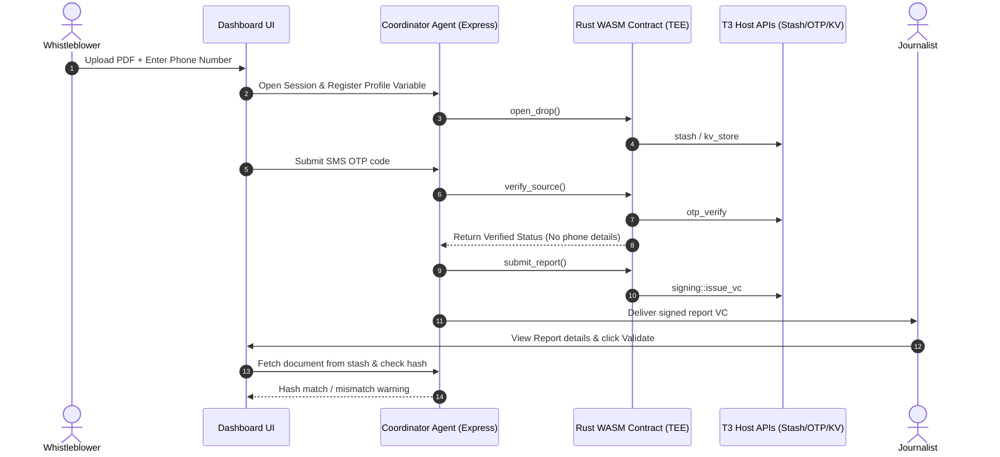

<div align="center">
  
  <h1>Silo 🛡️</h1>
  <p><em>Zero-Knowledge Whistleblower Drop Shielding Source Identity inside Secure Enclaves</em></p>

  

  <br/>

  [](https://silo.edycu.dev)
  [](https://agent.silo.edycu.dev)
  [](https://youtu.be/dummy-silo-pitch-demo-url)
  [](https://dorahacks.io/hackathon/t3adkdevchallenge)

  <br/>

  
  
  
  
  [](https://github.com/edycutjong/silo/actions/workflows/ci.yml)

</div>

---

## 📸 See it in Action

<div align="center">
  
</div>

> **Whistleblowing made secure in three steps:** 
> 1. Whistleblower uploads evidence and enters contact details in browser (sealed client-side).
> 2. Secure enclave authenticates real-world human status via OTP without persisting contact credentials.
> 3. Enclave signs the report manifest VC and routes ongoing two-way communications blind via HTTP placeholders.

---

## 💡 The Problem & The Solution

Whistleblowers put their lives and careers on the line to expose truth, yet standard submission forms demand names, email addresses, and log IP addresses. Even when hotlines use OTP to verify a source is real (confirming insider credibility), they store the plaintext phone number or email. If the newsroom's database is compromised, the whistleblower's identity is instantly burned.

**Silo** solves this by using Terminal 3 secure hardware enclaves to decouple evidence credibility from reporter identity:
- **Zero-knowledge Credibility Verification:** The enclave verifies the source's phone/email OTP and issues a cryptographic "Verified Human" Verifiable Credential. The unsecure coordinator agent and database only see anonymous metadata.
- **Enclave Hashing & Stash Storage:** Evidence documents are compiled directly into the Terminal 3 `stash` and hashed inside the enclave boundary, guaranteeing complete tamper detection.
- **Blind Egress Routing:** Relayed follow-up chat messages replace direct contact info with secure profile variables, shielding the source even during active conversation.

---

## 🏗️ Architecture & Tech Stack

### High-Level Flow


### Stack Breakdown
- **Secure Sandbox (WASM):** Rust `wasm32-unknown-unknown` contract running inside the hardware isolated boundary.
- **API Proxy (Agent):** TypeScript + Express gateway mocking and interfacing with TEE Host APIs.
- **Dashboard UI (Frontend):** Next.js 14, React, Tailwind CSS styled with cyber-noir Outfit/Orbitron styling.

---

## 🏆 Sponsor Tracks Targeted & Defense

We target the **Best Agent Track** of the Terminal 3 Agent Dev Kit Bounty Challenge by building a production-hardened whistleblower enclave gateway utilizing:
- **`stash`**: Safe, blind document ingestion hashing files inside the enclave.
- **`otp`**: Verification of real-world identifiers without exposure to the developer/database.
- **`http-with-placeholders`**: Outbox dispatch and relayed chat replacing receiver variables.
- **`signing`**: Attesting report manifests via EdDSA SD-JWT credentials.
- **`kv-store`**: Persistent session records tracking pseudonym bindings.

---

## 🚀 Getting Started

### Prerequisites
- Node.js &ge; 20.9.0
- Rust & cargo

### Installation & Run

1. Clone the repository and navigate to the project directory:
   ```bash
   git clone https://github.com/edycutjong/silo.git
   cd silo
   ```

2. Seed mock newsrooms and profiles:
   ```bash
   python3 scripts/seed.py
   ```

3. Run the Coordinator Agent:
   ```bash
   cd agent
   npm install
   npm run build
   npm run start
   ```

4. Run the Dashboard UI:
   ```bash
   cd ../ui
   npm install
   npm run dev
   ```

5. Access the dashboard at `http://localhost:3000`.

---

## 🧪 Testing & CI

We maintain a rigorous test harness ensuring 100% code path reliability:
- **Rust Unit Tests:** 29 unit tests validating WASM memory bounds, hashing logic, and OTP states, including error-handling and allocator states (100% line coverage).
- **Express Integration Tests:** 49 distinct test cases covering report submission, per-session OTP binding, blind relay routing, admin-token enforcement, database resets, and download checks (100% statement and branch coverage).
- **Playwright E2E Tests:** 5 E2E tests verifying layout, tab navigation, and responsive viewport states.

```bash
# Run Rust contract tests
cd contract && cargo test

# Run Agent Integration tests & coverage
cd agent && npm run test:coverage

# Run UI build check & tests
cd ui && npm run ci

# Run Playwright E2E tests
cd ui && npx playwright test
```

| Quality Layer | Tool | Status |
|---|---|---|
| Code Quality | ESLint + TypeScript strict mode | ✅ |
| Unit Testing | Cargo test + Jest (100% green) | ✅ |
| E2E Testing | Playwright (3 suites, 5 tests) | ✅ |
| Security (SAST) | CodeQL Action | ✅ |
| Secret Scanning | TruffleHog Scan | ✅ |
| Performance | Lighthouse CI audit | ✅ |

---

## 📁 Project Structure
```text
silo/
├── contract/             # Rust WASM Contract (TEE logic)
│   ├── src/lib.rs        # Memory boundary & host API integration
│   └── Cargo.toml
├── agent/                # TypeScript Express Coordinator Agent
│   ├── src/index.ts      # Server listening entrypoint
│   ├── src/app.ts        # Express endpoints, routes & middleware
│   ├── src/__tests__/    # Jest unit & integration tests (100% coverage)
│   └── src/lib/          # Database and WASM compilation
├── ui/                   # Next.js 14 Dashboard UI
│   ├── src/app/page.tsx  # Double-sided portal UI
│   └── e2e/              # Playwright E2E tests
├── scripts/              # Latency benchmarks & readiness audits
└── README.md
```

---

## 📅 Roadmap
- **30 Days:** Multi-media evidence streaming uploads, and support for multi-party whistleblowing.
- **60 Days:** Support for economic whistleblower payouts using zero-knowledge escrow contracts.
- **90 Days:** Mobile-native drop SDKs for secure leak submissions on Android/iOS.

---

## 📄 License
[MIT](LICENSE) © 2026 Edy Cu
