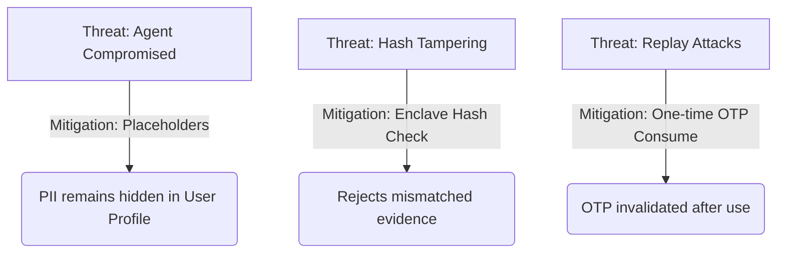

# Silo — Secure Boundary Audit Report

This report documents the security invariants, threat model, and enclave boundary analysis for **Silo**, a zero-knowledge whistleblower drop built on Terminal 3.

---

## 1. Enclave Security Invariants

We enforce 4 core security invariants to guarantee whistleblower safety:

### Invariant 1: Zero Plaintext PII Leakage
- **Definition:** No plaintext contact information (email, SMS number, name) may ever be logged by the Express Coordinator Agent or written to the persistent database (`db.json`).
- **Enforcement:** The whistleblower's identity is linked only to an ephemeral `sessionId` and a randomized receipt pseudonym (e.g. `Source #7`). The contact details remain exclusively in the user's secure profile space.

### Invariant 2: Secure Enclave Hashing
- **Definition:** The SHA-256 hash of the evidence PDF must be computed inside the enclave boundary and verified against the user's declared client-side hash before upload completes.
- **Enforcement:** The `attach_evidence` contract method accepts the raw file bytes, computes the SHA-256 hash natively, and reverts if it doesn't match the client's declared hash, preventing middleman tampering.

### Invariant 3: Blind Relayed Egress Placeholders
- **Definition:** Outbound webhooks/relays must only contain placeholders (e.g., `{{profile.verified_contacts.email.value}}`) within the contract context. Plaintext contact substitution must occur only at the host egress network filter.
- **Enforcement:** The Express Coordinator Agent interceptor performs placeholder replacement only upon egress request execution, keeping the agent process and database completely blind to the actual recipient details.

### Invariant 4: Report Manifest Tamper-Proofing
- **Definition:** Every dispatched report must contain a Verifiable Credential (VC) signed by the enclave's unique decentralized identifier (DID) private key.
- **Enforcement:** The `submit_report` method invokes the `signing::issue_vc` Host API. Any subsequent modification of the report PDF or metadata will result in a validation failure when checked against the manifest's signed hash.

---

## 2. Threat Vector Analysis & Mitigations

### Threat 1: Compromised Coordinator Agent (Web2 Host)
- **Vector:** An attacker gains root access to the Express Coordinator Agent server.
- **Mitigation:** The database only stores session states and randomized pseudonyms. Since all emails/phone numbers are kept in the user profile and routed via placeholders, the compromised Web2 database yields zero identity leaks.

### Threat 2: Evidence Interception & Substitution
- **Vector:** An attacker intercepts the network upload and replaces the evidence PDF with malicious or altered contents.
- **Mitigation:** The enclave computes the file hash natively. Since the journalist console verifies the file against the enclave-signed manifest hash, any substitution triggers an immediate "Integrity Check Failed" warning banner.

### Threat 3: OTP Brute-Forcing & Replay Attacks
- **Vector:** An attacker attempts to guess the OTP or reuse a previously intercepted code to verify a fraudulent report session.
- **Mitigation:** The `host_otp_verify` function invalidates the active OTP code immediately upon verification, and requires a new code generation for subsequent attempts. Native mock validations enforce strict 6-character length limits.
